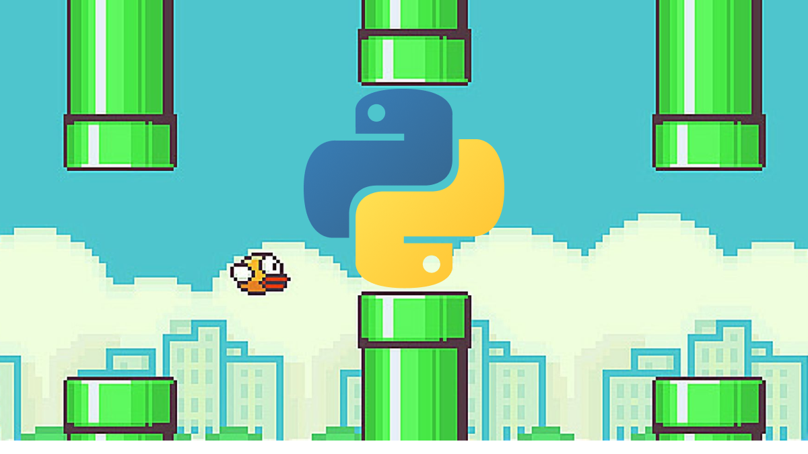

# FlappyPi



A simple Flappy Bird clone built with Pygame for benchmarking purposes (not actually I just saw something on reddit and thought it would be funny to try)

## Setup Instructions

1. Clone this repository and navigate to the project directory

2. (Optional but recommended) Create and activate a virtual environment:

   ```bash
   # Create virtual environment
   python3 -m venv venv

   # Activate virtual environment
   # On macOS/Linux:
   source venv/bin/activate
   # On Windows:
   venv\Scripts\activate
   ```

3. Install dependencies:
   ```bash
   pip install -r requirements.txt
   ```

4. Run the game:
   ```bash 
   python main.py
   ```

## About

This is a minimal Flappy Bird implementation used for benchmarking, inspired by [this Reddit post](https://www.reddit.com/r/selfhosted/comments/1ic8zil/yes_you_can_run_deepseekr1_locally_on_your_device/) about model compression techniques.

## Thinking Times

| Version                                          | Thought Time         |
|--------------------------------------------------|----------------------|
| o1                                               | 23 seconds           |
| o3-mini-high                                     | 1 minute 52 seconds  |
| o3-mini                                          | 58 seconds           |
| gemini 2.0 flash thinking experimental 01-21     | 10.4 seconds         |


Here's the prompt: 
``` markdown 
You must use pygame.

The background color should be randomly chosen and is a light shade. Start with a light blue color.

Pressing SPACE multiple times will accelerate the bird.

The bird's shape should be randomly chosen as a square, circle or triangle. The color should be randomly chosen as a dark color.

Place on the bottom some land colored as dark brown or yellow chosen randomly.

Make a score shown on the top right side. Increment if you pass pipes and don't hit them.

Make randomly spaced pipes with enough space. Color them randomly as dark green or light brown or a dark gray shade.

When you lose, show the best score. Make the text inside the screen. Pressing q or Esc will quit the game. Restarting is pressing SPACE again.
```

